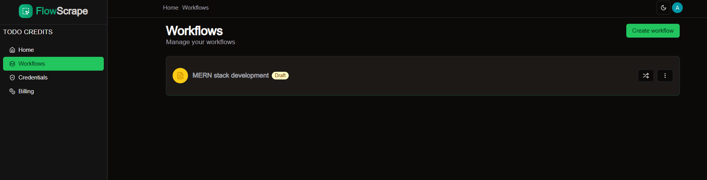

<h1>SCRAPE FLOW</h1>

Scrape flow is a web application used for web scraping the contents of an application in a way whereby we can extract content of a webpage such as the html elements, the selector and so on 

<h3>The Hoem Page</h3>

<h3>The navigation page</h3>

<h3> The workflow editor</h3>

<h3>The workflow page</h3>

<h3>The workflow execution</h3>

<h3>The dark mode</h3>

