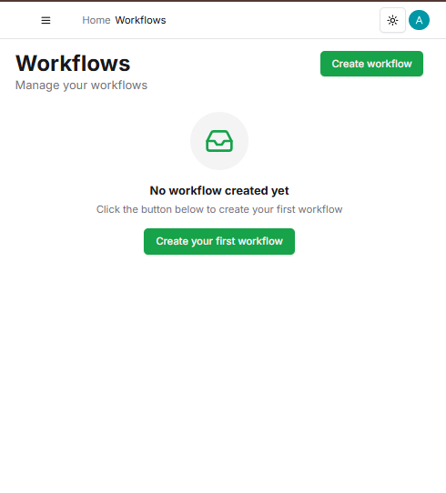
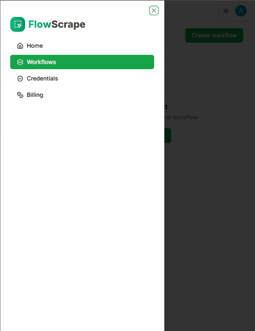
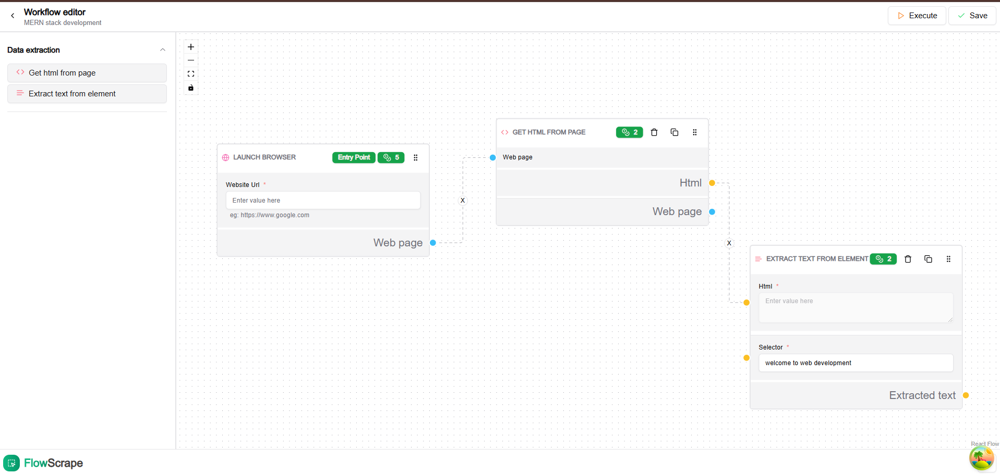
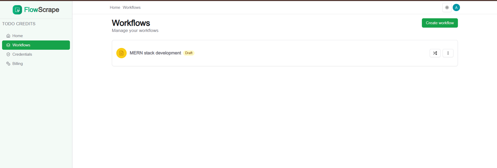
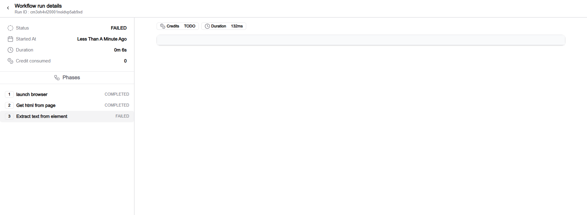
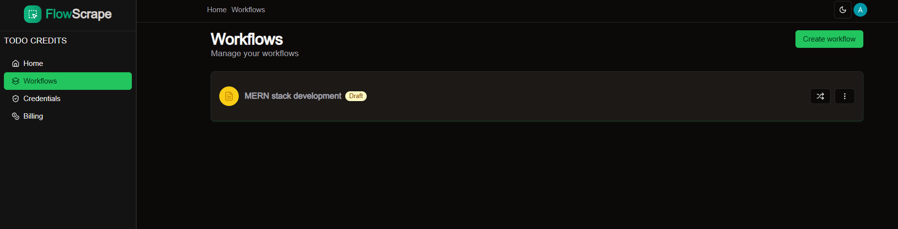

<h1>SCRAPE FLOW</h1>

Scrape flow is an AI application that is used to extract large datasets of data from a website 

<h3>The Home Page</h3>

<h3>The navigation page</h3>

<h3> The workflow editor</h3>

<h3>The workflow page</h3>

<h3>The workflow execution</h3>

<h3>The dark mode</h3>

<h3>The execution phase</h3>

